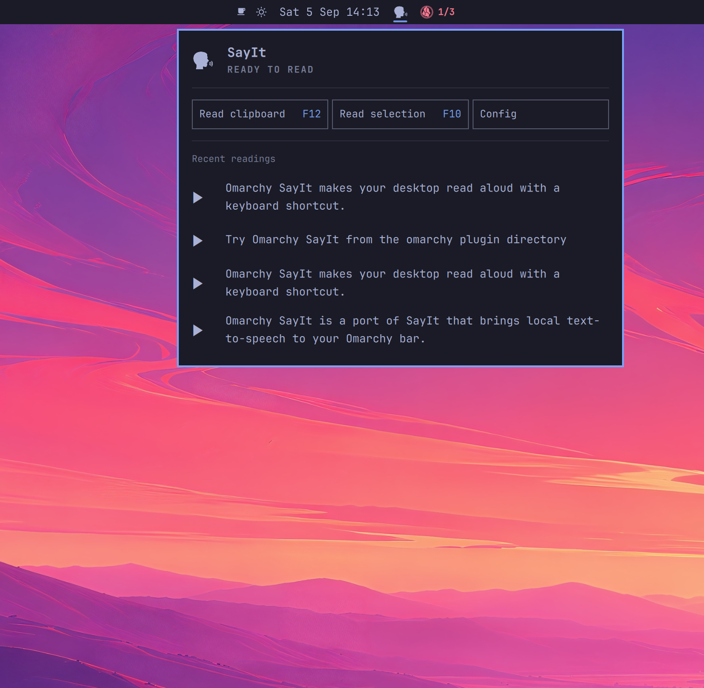

# SayIt for Omarchy

A native Linux port in progress of [callebtc/sayit](https://github.com/callebtc/sayit). Select text, press F10, and hear a local speech model read it aloud. F9 remains Omarchy's Voxtype dictation shortcut.

**This is an early working port, not full upstream parity.** Kokoro has been tested with real offline English and Spanish synthesis on Omarchy. Only Kokoro on Linux x86-64 CPU is enabled. Qwen3-TTS, Chatterbox and OmniVoice are disabled until their dependencies, model artifacts and auxiliary downloads are locked and tested. Japanese and Chinese are also disabled for now. The catalog retains all 22 upstream entries, including models that have not been ported. See [the parity tracker](docs/parity.md).



## What works

- Explicit Wayland selection or clipboard reading, without clipboard monitoring.
- GTK player and optional tray menu, pause/resume, stop, seek and 0.5–2× playback speed.
- Speech starts after the first text chunk; subsequent chunks play as they become ready. The player displays the current chunk of text.
- A per-user service, CLI, queue policies, saved audio history, replay and audio export.
- One resident synthesis worker, model switching and configurable idle unloading.
- Voice sample recording/import, duration/silence/clipping checks, saved profiles and optional transcription using the installed local Voxtype Whisper model.
- MPRIS controls for media keys, Omarchy's media UI and Voxtype's pause-during-recording behavior.
- An optional token-protected loopback HTTP API. It is disabled by default.

## Install on Omarchy

The desktop app uses system Python and GTK through PyGObject. Kokoro uses a separate Python 3.11.16 environment. Setup verifies the pinned Python archive checksum and installs the committed dependency lock with artifact hashes; source builds are disabled.

Install missing system dependencies with Omarchy's package command:

```sh
omarchy pkg add python python-gobject gtk3 mpv wl-clipboard ffmpeg
```

Omarchy normally includes PipeWire's `pw-record` for recording. `libayatana-appindicator` adds the optional tray menu. Voxtype is optional and only needed for automatic reference transcription and dictation integration.

Install the bar plugin, then use a separate checkout for the speech service:

```sh
omarchy plugin add https://github.com/digitalbase/omarchy-sayit --enable
git clone https://github.com/digitalbase/omarchy-sayit.git
cd omarchy-sayit
```

Adding the plugin installs the bar interface only. It does not install Python engines, download model weights or start the speech service. Run the following commands explicitly to set those up. If you already have a source checkout, run them there instead. Keep the engine environments outside the installed plugin directory so Omarchy can validate plugin updates:

```sh
./scripts/bootstrap.sh
./bin/sayit setup kokoro
./bin/sayit download kokoro-bf16
./scripts/install.sh
sayit ui
```

The installer links this checkout into `~/.local/bin`, installs a desktop launcher and enables a user service. Keep the checkout in place. Open Config in the bar popup and save Settings to apply the selection and clipboard shortcuts. Selection defaults to F10; clipboard defaults to unassigned. Settings checks conflicts, backs up the user bindings, reloads Hyprland and restores the old file if validation fails. Optional playback shortcuts are in [integration/bindings.lua](integration/bindings.lua).

| Shortcut | Action |
| --- | --- |
| F9, existing Omarchy binding | Hold to dictate with Voxtype |
| F10 | Read selected text |
| Unassigned by default | Read clipboard; configurable in Settings |
| Ctrl+F10 | Pause/resume |
| Alt+F10 | Stop and clear the queue |
| Super+F10 | Open the player |

Some Wayland apps do not publish a primary selection. In those apps, copy the text and click Read clipboard, or assign a clipboard shortcut in Settings. There is no universal Linux equivalent of macOS Accessibility selection retrieval.

## Remove

If you installed the speech service, stop it before removing its checkout:

```sh
systemctl --user disable --now sayit.service
rm -f ~/.config/systemd/user/sayit.service
systemctl --user daemon-reload
rm -f ~/.local/bin/sayit ~/.local/share/applications/omarchy-sayit.desktop
omarchy plugin remove digitalbase.sayit
```

These commands remove SayIt's service and launcher. Remove its managed shortcut block between `-- BEGIN SAYIT SHORTCUTS` and `-- END SAYIT SHORTCUTS` from `~/.config/hypr/bindings.lua`, along with any optional SayIt playback bindings you added, then run `hyprctl reload`.

Downloaded models, saved recordings, voice samples and settings remain in `~/.local/share/sayit` and `~/.config/sayit`. Delete these directories separately if you want to erase that data.

## Omarchy bar player

Install the native Quickshell bar popup with:

```sh
./scripts/install-bar.sh
```

SayIt's original speaking-profile icon sits in the center section of the bar. The compact popup has selection/clipboard reading and play buttons beside four recent readings. A playing reading's button pauses or resumes it. Right-clicking the bar icon also toggles playback. The left-aligned top buttons are Read clipboard, Read selection and Config. The buttons have equal widths and aligned labels, with configured shortcuts shown beside their labels in the accent color. Recent readings wrap to at most two lines and truncate longer text with an ellipsis. The bar icon pulses in the accent color during generation and remains steady during playback. Config opens Settings directly, including the two shortcut fields. Use Record shortcut to press a combination, Escape to cancel, or Backspace to clear it; manual entry remains available for keys intercepted by the desktop. Changes apply when you save. Models, voices and the full player are available in the other tabs. The header uses Omarchy's PanelHero component, and reading rows use the same typography and outward hover margins as Obsidian Daily. The icon comes from upstream SayIt under its MIT license; see the bundled icon notice.

The installer backs up your bar configuration and installs `digitalbase.sayit` under the user plugin directory. No packaged Omarchy files are changed. Disable it with `omarchy plugin disable digitalbase.sayit`.

## CLI

```sh
sayit "Read this aloud"
printf 'Read from stdin' | sayit
sayit selection --detach
sayit clipboard --detach
sayit speak "Read this next" --enqueue --detach
sayit pause
sayit resume
sayit seek 10
sayit skip -5
sayit rate 1.3
sayit stop
sayit history
sayit replay JOB_ID
sayit export JOB_ID speech.mp3
sayit status --follow
sayit status --follow --bar
sayit doctor
```

The default queue policy interrupts the current job and preserves pending jobs. `--enqueue` appends; `--replace-all` cancels current and pending jobs. `--detach` returns the accepted job immediately, which also supports spoken coding-agent updates.

```sh
sayit settings model kokoro-bf16
sayit settings idle_seconds 600
sayit settings device cpu
sayit settings selection_shortcut F10
sayit settings clipboard_shortcut "CTRL + ALT + R"
sayit settings clipboard_shortcut ""  # Unassign
sayit models
sayit setup kokoro
sayit download kokoro-bf16
sayit speak "Hello" --model kokoro-bf16 --voice af_heart
```

Setup currently supports Linux x86-64 CPU only; `--cuda` fails without installing anything. Existing model IDs retain upstream names for traceability. The `bf16` suffix describes the upstream entry; this CPU runtime uses float32.

Compatible Kokoro community repositories require explicit verification metadata:

```sh
sayit add-model my-model owner/repository --base kokoro-bf16 --revision FULL_40_CHARACTER_COMMIT_SHA --artifacts /path/to/artifact-hashes.json
sayit download my-model
```

The artifacts file is a JSON object mapping `config.json`, `kokoro-v1_0.pth` and every declared `voices/NAME.pt` to its SHA-256 digest. The full commit SHA and hashes must be independently reviewed before registration. SayIt never derives trusted hashes from a download at runtime. Missing pins, unsupported engines, unsafe paths and undeclared voices are rejected, including for manually edited custom entries.

Custom repositories must have the same architecture and layout as Kokoro. They inherit its voice/language metadata; adjust the declared presets in `~/.config/sayit/models.json` if needed. Hashes bind content but do not establish that a model is trustworthy. Review its contents and license first.

## Runtime source verification

Every enabled model declares a full repository commit and SHA-256 hashes in `sayit/models.json`. Downloads fetch only those files from that commit, verify each temporary file before publishing it, and never initialize a model online. Model loading verifies all declared artifacts again, even if the ready marker exists. Legacy ready markers do not bypass verification. Inference workers reject network connections and dependency-install subprocesses; the system `ldconfig -p` lookup used by ctypes is the sole subprocess exception. This guard prevents accidental implicit downloads; it is not a sandbox for hostile Python or native code.

`sayit/locks/` contains the exact dependency versions and distribution hashes, bootstrap uv lock, and Python archive URL/checksum. Setup consumes these locks using hash-required, wheel-only sync, without dependency resolution or source builds. The English spaCy model wheel is locked too. Engine directories are named by lock digest so old unverified environments are not reused.

For an existing installation, run `./scripts/bootstrap.sh`, `sayit setup kokoro` and `sayit download kokoro-bf16`, then restart `sayit.service`. Valid cached model files are reused after hashing. Old engine directories are retained and can be removed manually once migration succeeds.

See [the lock review notes](docs/runtime-locks.md) for artifact provenance, checks and the supported build procedure.

## Voice studio and Voxtype

Clone synthesis and voice design are currently disabled. You can still record and manage samples for future use. Record a sample in Voice studio or import an existing audio file. Use a clean 6–10 second recording and the exact words spoken. Different models impose different duration limits. Use a voice you have permission to clone.

```sh
sayit voices add "My voice" reference.wav --transcript "The words I said."
sayit voices add "My voice" reference.wav --transcribe
sayit speak "Hello again" --model qwen3-06b-base-8bit --voice-profile "My voice"
```

`--transcribe` converts the sample to 16 kHz mono and invokes `voxtype --engine whisper --whisper-mode local transcribe`. It reuses the installed Whisper model, reads no clipboard and pastes nothing. Review the transcript before using it. Automatic transcription can mishear names.

Your Voxtype setting `audio.pause_media = true` makes F9 pause actively playing MPRIS players, including SayIt, and resume them afterwards. SayIt uses the standard protocol; it does not replace or rebind Voxtype. See [the integration findings](docs/voxtype.md).

## Local API

Stop the installed service before running a foreground instance:

```sh
systemctl --user stop sayit.service
sayit daemon --http-port 8765
```

The API binds only `127.0.0.1`. Every route requires `Authorization: Bearer TOKEN`; the token is in `~/.config/sayit/api-token` with mode 0600. No CORS access is enabled.

| Method and route | Body or result |
| --- | --- |
| `GET /v1/status` | Playback state |
| `GET /v1/models` | Catalog and installed status |
| `GET /v1/voices` | Saved profiles |
| `GET /v1/history`, `GET /v1/jobs` | Jobs and audio paths |
| `POST /v1/speech` | `{"text":"Hello", "model":"kokoro-bf16", "policy":"enqueue"}` |
| `POST /v1/playback` | `{"command":"pause"}` or other playback commands |

This API is not wire-compatible with upstream SayIt's REST API. Stop the foreground instance and run `systemctl --user start sayit.service` to return to the normal desktop service.

## Storage and privacy

`~/.config/sayit` holds settings and the optional API token. `~/.local/share/sayit` holds engine environments, downloaded models, voice samples, history, audio and engine logs. `$XDG_RUNTIME_DIR/sayit` holds private sockets. Standard XDG overrides are supported.

Downloads and engine installation use the network. Synthesis workers set Hugging Face and Transformers offline mode. Some language frontends may need a separate initial dictionary download; only Kokoro English and Spanish have been verified offline. Engine packages and community models are third-party software.

History intentionally retains text and audio. There is no automatic retention limit yet. MPRIS metadata uses a generic title instead of exposing spoken text to other media widgets. The service does not collect analytics or monitor clipboard contents.

## Development and removal

```sh
python -m unittest discover -s tests -v
python -m compileall -q sayit
journalctl --user -u sayit.service
```

To remove the app, disable `sayit.service`, remove its unit, the `~/.local/bin/sayit` symlink and `~/.local/share/applications/omarchy-sayit.desktop`, then remove any bindings you added. Your models and recordings remain in the XDG data directory until you choose to delete them.

The upstream MIT notice is retained in [LICENSE](LICENSE). Model licenses are separate. Upstream catalog snapshot: `callebtc/sayit@fbf019a81f3b40788d117314188a65a5cffa7cb6`.
